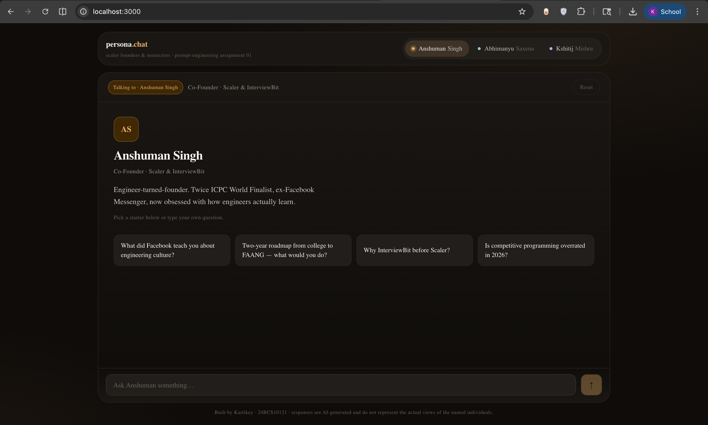
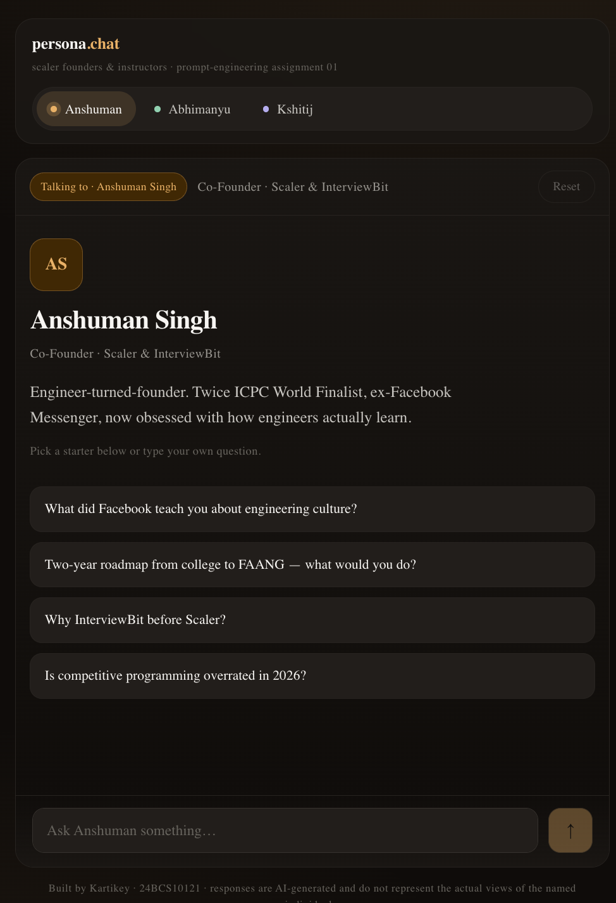

# persona.chat

A persona-based AI chatbot that lets you have real conversations with three figures from the Scaler / InterviewBit ecosystem — **Anshuman Singh**, **Abhimanyu Saxena**, and **Kshitij Mishra** — each driven by a hand-written, research-backed system prompt.

> Submitted as **Assignment 01 — Persona-Based AI Chatbot** for the Prompt Engineering module at Scaler Academy.
>
> **Author:** Kartikey · **Roll No:** 24BCS10121

---

## Live demo

🔗 **<add-your-vercel-url-here>**

> Deploy on Vercel with your own `GEMINI_API_KEY` and paste the URL above. See [Deploying to Vercel](#deploying-to-vercel) below.

## Screenshots

> Add `public/screenshots/desktop.png` and `public/screenshots/mobile.png` after running locally so the README looks complete.

| Desktop | Mobile |
| --- | --- |
|  |  |

---

## What this is

A single-page Next.js app where the user picks one of three personas, asks them anything, and gets a streamed reply written entirely in that person's voice. Switching personas resets the conversation so personalities never bleed into one another. The system prompts (in [`lib/personas.ts`](./lib/personas.ts)) are the actual product — the rest is plumbing.

## Features

- **Three distinct personas**, each with a multi-section system prompt covering identity, voice, internal chain-of-thought, three illustrative dialogues, output rules, and explicit guardrails
- **Top-bar persona switcher** with per-persona accent colour
- **Quick-prompt chips** tailored to each persona for one-click starters
- **Streamed Gemini responses** — tokens land in the bubble as they arrive
- **Animated typing indicator** while the model is thinking
- **Conversation reset** on persona switch and via an explicit Reset button
- **Mobile-friendly** down to ~360px width
- **Server-side API key** — `GEMINI_API_KEY` is never sent to the browser
- **Graceful API errors** rendered inline as a non-blocking alert

## Stack

- [Next.js 14](https://nextjs.org/) App Router + TypeScript (the API route is a Vercel serverless function — there is no separate backend)
- [Tailwind CSS](https://tailwindcss.com/) for utilities, plus a hand-written `globals.css` for the design system
- [`@google/generative-ai`](https://www.npmjs.com/package/@google/generative-ai) talking to **Gemini 2.5 Flash**
- Deployed on [Vercel](https://vercel.com/)

## Repo layout

```
assignement-1/
├── app/
│   ├── api/chat/route.ts     # Gemini streaming endpoint (the entire backend)
│   ├── globals.css           # Dark-default design system
│   ├── layout.tsx            # Fonts + metadata
│   └── page.tsx              # Single-page chat UI
├── components/
│   ├── PersonaTabs.tsx       # Top-bar tab switcher
│   ├── PersonaIntro.tsx      # Empty-state intro card
│   ├── QuickPrompts.tsx      # Suggestion-chip grid
│   ├── MessageRow.tsx        # One bubble in the thread
│   ├── PromptBar.tsx         # Auto-resizing textarea + send
│   └── Dots.tsx              # Three-dot typing indicator
├── lib/
│   ├── personas.ts           # All three system prompts + UI metadata
│   ├── gemini.ts             # Streaming Gemini client
│   └── types.ts              # Shared TypeScript types
├── prompts.md                # Annotated system prompts + design rationale
├── reflection.md             # 300–500 word reflection
├── .env.example              # Documents required env vars
└── README.md
```

## Local setup

**Prerequisites:** Node.js 18.17+ (Node 20 LTS recommended) and npm.

```bash
# 1. Clone
git clone <your-repo-url>
cd assignement-1

# 2. Install
npm install

# 3. Configure
cp .env.example .env.local
# Open .env.local and paste your Gemini key:
#   GEMINI_API_KEY=...
# Get one for free at https://aistudio.google.com/app/apikey

# 4. Run
npm run dev

# 5. Open
# http://localhost:3000
```

## How a turn works

```
Browser (React)
    │  fetch("/api/chat", { messages, persona })
    ▼
app/api/chat/route.ts        ← runs as a Vercel serverless function
    │  picks the persona's system prompt from lib/personas.ts
    ▼
lib/gemini.ts → Google Gemini API (streamed)
    │  ReadableStream of UTF-8 chunks
    ▼
Browser pipes chunks into the active assistant bubble
```

There is no separate backend service — the API route IS the backend, and Vercel deploys it transparently.

## Environment variables

| Variable          | Required | Default              | Notes                                                                  |
| ----------------- | -------- | -------------------- | ---------------------------------------------------------------------- |
| `GEMINI_API_KEY`  | yes      | —                    | Free key from [Google AI Studio](https://aistudio.google.com/app/apikey) |
| `GEMINI_MODEL`    | no       | `gemini-2.5-flash`   | Override if you want to try a different Gemini variant                 |

The key is read only inside `app/api/chat/route.ts` (a Node-runtime route) and never reaches the client bundle.

## Deploying to Vercel

1. Push this folder to a public GitHub repo.
2. Go to [vercel.com/new](https://vercel.com/new), import the repo. If the repo root is a parent of this folder, set **Root Directory** to `assignement-1`.
3. In **Settings → Environment Variables**, add `GEMINI_API_KEY` with your key.
4. Click **Deploy**. The first build takes ~60 seconds.
5. Paste the resulting `*.vercel.app` URL into the **Live demo** section above.

No build, output, or start command overrides are required — Vercel auto-detects Next.js.

## Submission checklist

- [x] Public GitHub repo with a clean structure
- [x] `README.md` with setup steps and a live-link slot
- [x] `prompts.md` with all three annotated system prompts
- [x] `reflection.md` (300–500 words)
- [x] `.env.example` present, `.env.local` gitignored, no API key committed
- [x] All three personas functional with distinct, researched prompts
- [x] Persona switching resets the conversation
- [x] Quick-prompt chips per persona
- [x] Typing indicator
- [x] Streaming responses
- [x] Mobile-responsive
- [x] Graceful API error handling
- [ ] Deployed and live (paste URL above before submitting)

## A note on the personas

The three subjects are real public figures. Their system prompts are stitched together from publicly available material — talks, interviews, podcasts, LinkedIn posts. Outputs are AI-generated and should not be read as their actual statements.

---

*Built by Kartikey (24BCS10121) for Scaler Academy · Prompt Engineering · 2026.*
